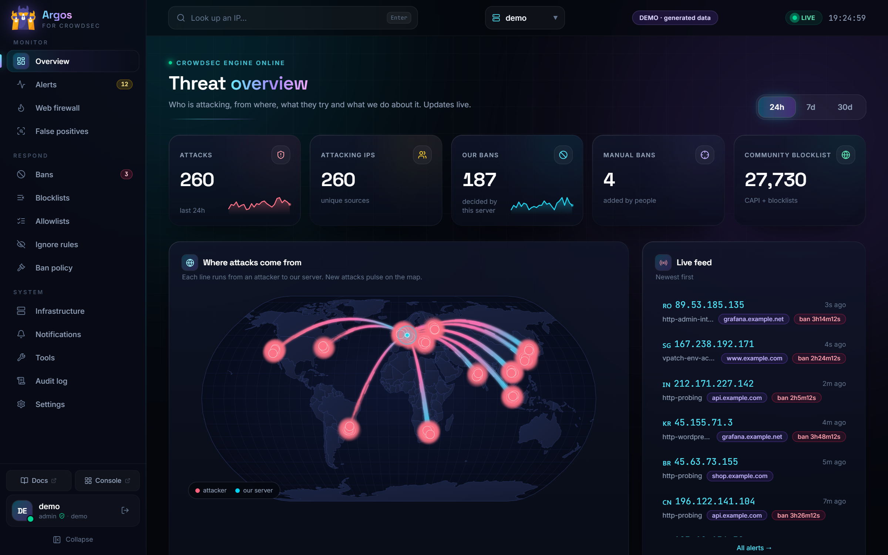
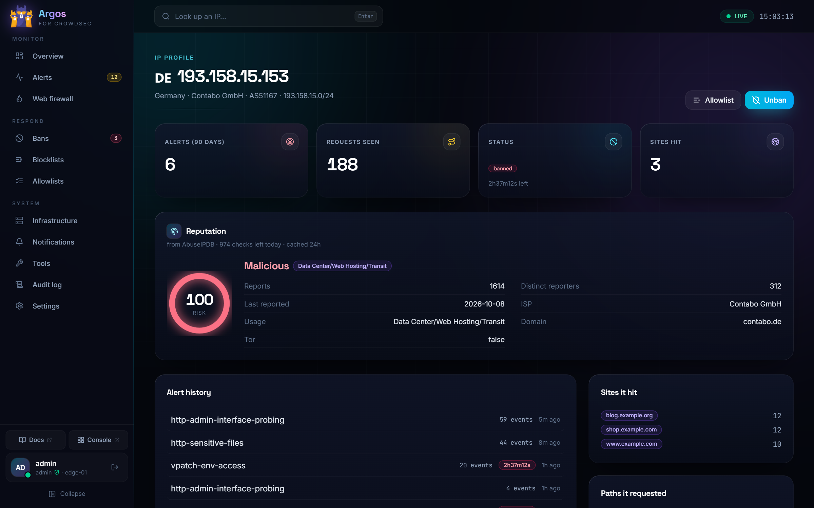
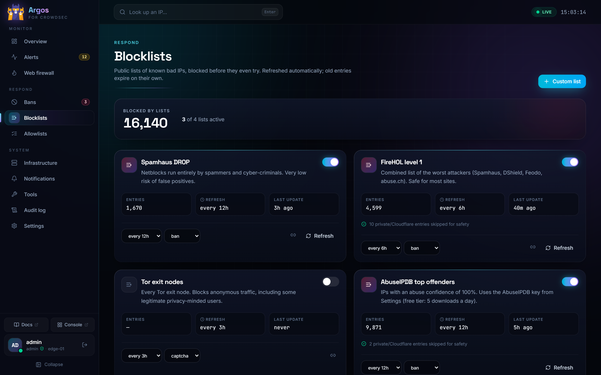
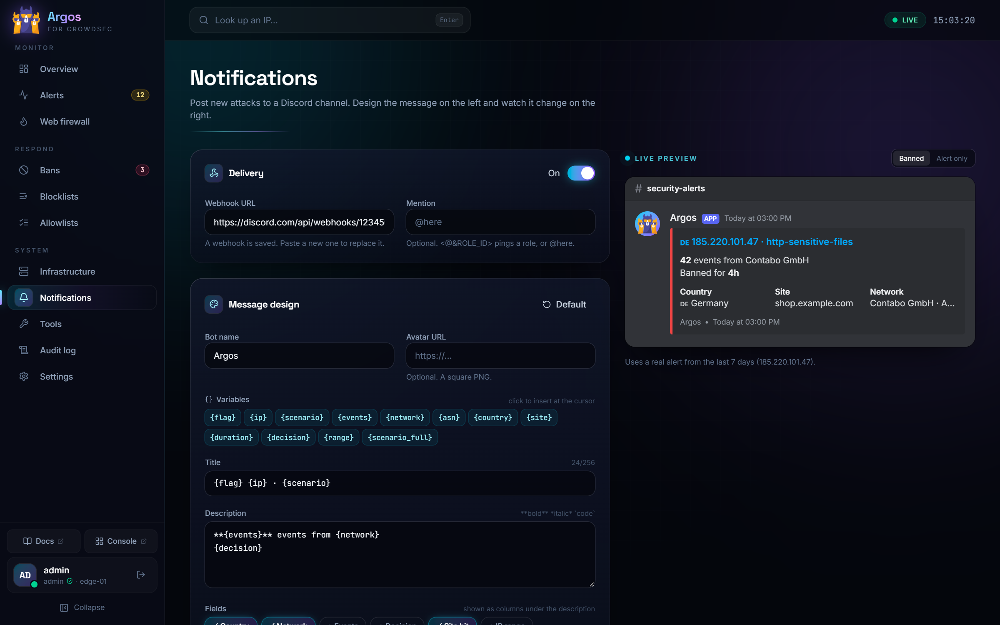
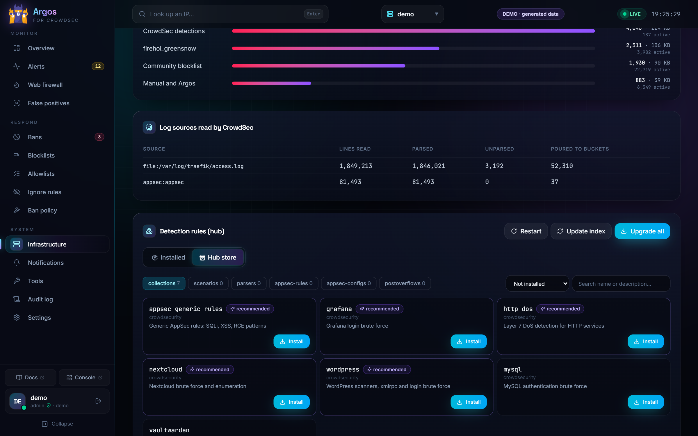
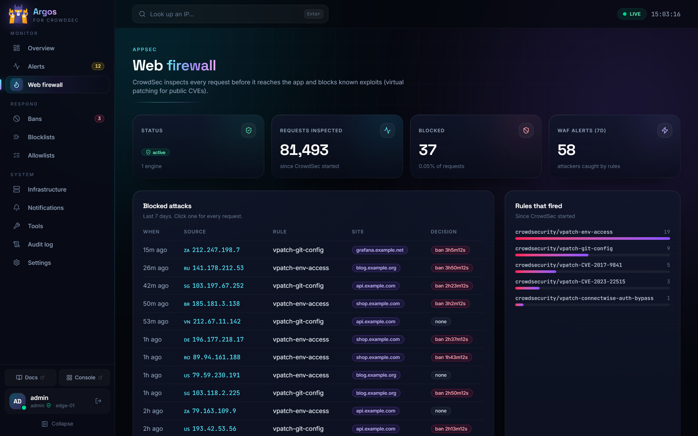
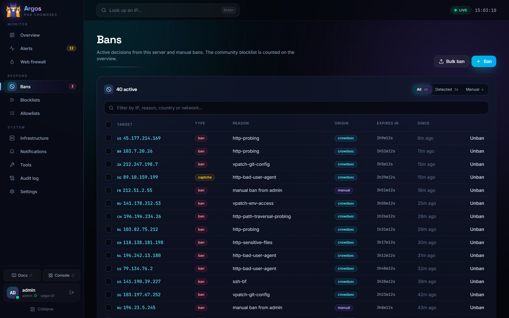

<p align="center">
  
</p>

<h1 align="center">Argos</h1>

<p align="center">
  <i>Argos Panoptes, the hundred-eyed watchman who never slept.</i><br><br>
  A self-hosted control panel for <a href="https://www.crowdsec.net/">CrowdSec</a>.<br>
  Live attack map, alerts, bans, blocklists, WAF, hub store, Cloudflare and Discord, in one fast UI.
</p>

<p align="center">
  
  
  
</p>



## Features

- **Live overview**: attacks, attacking IPs, bans and the community blocklist at a glance, a world map with an arc from every attacker to your server, and a live feed over server-sent events
- **Alerts**: every detection with the requests behind it (path, status, user agent, site)
- **Bans**: ban or unban IPs, ranges, countries or AS numbers; bulk ban; captcha instead of ban
- **IP profile**: history, sites and paths hit, reputation from CrowdSec CTI or AbuseIPDB (auto falls back when one runs out of quota)
- **Blocklists**: Spamhaus DROP, FireHOL level 1, Tor exits, AbuseIPDB top offenders or any URL, refreshed on a schedule. Private ranges, your own IPs and Cloudflare are always skipped
- **Web firewall**: CrowdSec AppSec metrics, blocked requests and the rules that fired
- **Hub store**: browse and install collections, scenarios, parsers and AppSec rules; upgrade everything with a dry-run preview; CrowdSec restarts on its own
- **Simulation mode** per scenario, to try a rule without banning anyone
- **Tools**: `cscli explain` log tester and CrowdSec Console enrollment
- **Cloudflare**: Under Attack mode per zone, with a req/s chart from Prometheus
- **Discord**: new attacks as embeds you design in the UI with a live preview, with per-IP cooldown and an hourly cap
- **More channels**: Telegram, Slack, ntfy (phone push), email and signed JSON webhooks, plus a **daily or weekly summary** of attacks, bans, top countries and sites
- **Grafana alert relay**: turns Grafana's webhook into proper Discord embeds (severity colour, value, labels, links)
- **Users**: admin / operator / viewer roles, TOTP 2FA, audit log of every change

<table>
  <tr>
    <td></td>
    <td></td>
  </tr>
  <tr>
    <td></td>
    <td></td>
  </tr>
  <tr>
    <td></td>
    <td></td>
  </tr>
</table>

## Try it in 10 seconds

No CrowdSec needed: the demo runs on generated data, with attacks arriving live on the map. Nothing can be changed.

```sh
docker run --rm -p 3000:3000 -e DEMO=1 ghcr.io/georgemos940/crowdsec-argos-ui:latest
```

Open `http://localhost:3000`.

## Starting from zero

[`examples/all-in-one`](examples/all-in-one) runs CrowdSec, Traefik with the CrowdSec bouncer, a test app and Argos together. Argos registers itself with CrowdSec on first start.

```sh
cd examples/all-in-one
cp .env.example .env        # four secrets: openssl rand -hex 32
docker compose up -d
docker compose logs argos | grep 'Setup token'
```

The app is on `http://localhost:8080`, Argos on `http://localhost:3000`. Add the `crowdsec@docker` middleware to any other router you want protected.

## Quick start (existing CrowdSec)

CrowdSec must already run in Docker. The panel talks to its Local API as a machine and runs `cscli` inside the CrowdSec container.

**1. Create a machine for the panel** (or set `LAPI_AUTO_REGISTER=true` and skip this)

```sh
PW=$(openssl rand -hex 32)
# -f /dev/null keeps cscli from overwriting crowdsec's own credentials file
docker exec crowdsec cscli machines add argos --password "$PW" -f /dev/null
echo "$PW"
```

**2. Configure**

```sh
cp .env.example .env
# set LAPI_PASSWORD to the password above; SESSION_SECRET and DOCKER_PROXY_TOKEN to: openssl rand -hex 32
```

**3. Run**

```sh
docker compose up -d
docker logs argos | grep 'Setup token'
```

Open `http://127.0.0.1:3010`, paste the setup token and create the first admin.

> CrowdSec rejects LAPI logins whose User-Agent is not `name/version`; the panel already sends one.

## Configuration

| Variable | Default | |
|---|---|---|
| `SESSION_SECRET` | | required, signs sessions |
| `LAPI_URL` | `http://crowdsec:8080` | CrowdSec Local API |
| `LAPI_USER` / `LAPI_PASSWORD` | | the machine from step 1 |
| `LAPI_AUTO_REGISTER` | `false` | `true` creates that machine through `cscli` when the login is refused (password 16+ chars) |
| `DEMO` | | `1` runs on generated data, read-only, no CrowdSec needed |
| `CROWDSEC_CONTAINER` | `crowdsec` | container name for `cscli` and restarts |
| `DOCKER_PROXY_URL` / `DOCKER_PROXY_TOKEN` | | how Argos reaches Docker through `argos-docker-proxy` (set in `docker-compose.yml`) |
| `DOCKER_SOCKET` | `/var/run/docker.sock` | only without the proxy |
| `DATA_DIR` | `./data` | SQLite database (users, settings, audit) |
| `INSTANCE_NAME` | `crowdsec` | shown in the sidebar, used for Console enrollment |
| `HOME_LAT` / `HOME_LON` | Frankfurt | your server on the attack map |
| `SELF_IPS` | | IPs or ranges blocklists must never ban |
| `PROM_URL` | `http://prometheus:9090` | optional, charts |
| `CF_API_TOKEN` / `CF_ZONE_IDS` | | optional, Cloudflare Under Attack switch. Token needs Zone Settings edit |
| `ZONE_RPS_QUERY` | | optional, Prometheus query with a `zone` label for the Cloudflare chart |
| `COOKIE_SECURE` | `true` | set `false` only when serving over plain http |
| `TRUST_PROXY` | `false` | `true` behind a reverse proxy, so login rate limits and the audit log see the real client IP from `X-Real-IP` / `X-Forwarded-For`. Leave `false` when the panel is reached directly, or anyone can fake their address |

API keys for CrowdSec CTI and AbuseIPDB, the Discord webhooks and blocklists are set in the UI.

## Grafana alerts to Discord

Grafana's Discord integration only fills the embed title. Point a **webhook** contact point at the panel instead. **Notifications → Grafana alerts** shows the URL and the bearer token to copy, and takes the Discord webhook the embeds go to. Grafana reaches the panel over the Docker network (`http://argos:3000/hooks/grafana`).

## Security

- **Argos never holds the Docker socket.** A second container from the same image, `argos-docker-proxy`, does, and it only lets through:
  - an exec in the CrowdSec container whose argv passes the `cscli` allow-list (`server/src/argv.ts`), checked again there, never a shell
  - reading back the execs it created, and a restart of the CrowdSec container

  Everything else (other containers, `create`, `json`, images, volumes) gets a 403, and the proxy sits on an internal-only network with a token. If Argos itself were compromised, the worst it can do is run the allowed `cscli` commands.
- Keep it off the open internet when you can: bind to localhost or a VPN address, or put an IP allow-list or SSO in front
- Passwords are hashed with scrypt; sessions are `__Host-` HTTP-only, `SameSite=Strict` cookies that end on password or 2FA changes
- Optional **Require 2FA for everyone** (Settings → Users): accounts without TOTP must enrol before they see anything. TOTP codes cannot be replayed
- Failed logins are limited per IP and per username; unknown usernames take as long as wrong passwords
- Every write needs a same-origin request header and a matching `Origin`, on top of the cookie, so CSRF is refused twice
- Strict security headers: CSP without inline scripts, HSTS, `frame-ancestors 'none'`, no-store on the API
- Blocklist URLs cannot point at private, loopback or link-local addresses (no SSRF into the LAPI, Docker or cloud metadata)
- Errors only carry details for signed-in users
- Every change is written to the audit log

If you do put it on the internet, put it behind HTTPS with `TRUST_PROXY=true`, turn on **Require 2FA for everyone**, and remember that an admin in Argos can run the allowed `cscli` commands on your CrowdSec.

## Development

```sh
npm install
npm run dev:web       # vite on :5173, proxies /api to :3000
SESSION_SECRET=dev LAPI_USER=... LAPI_PASSWORD=... LAPI_URL=http://localhost:8080 COOKIE_SECURE=false npm run dev:server
```

```sh
npm test              # blocklist parser, ssrf guard, roles, cscli allow-list, hub upgrade plan
DEMO=1 npm start      # after npm run build
```

Stack: Node 22, Hono, node:sqlite, React 19, Vite, Tailwind 4, Recharts, d3-geo.

## License

MIT
