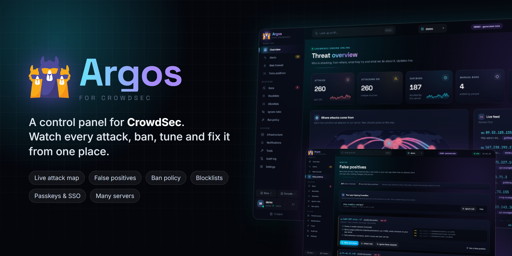
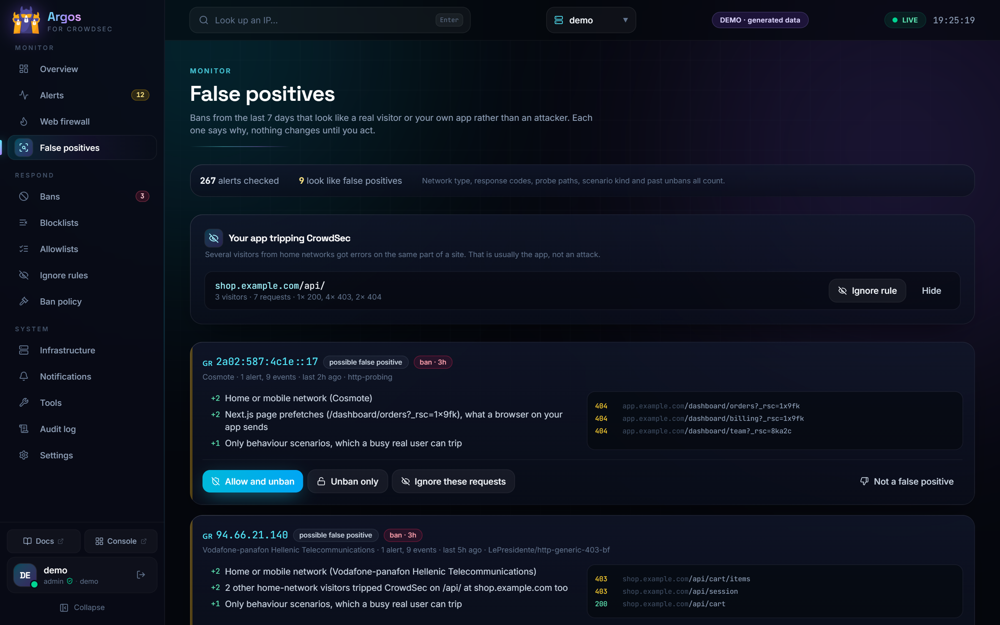
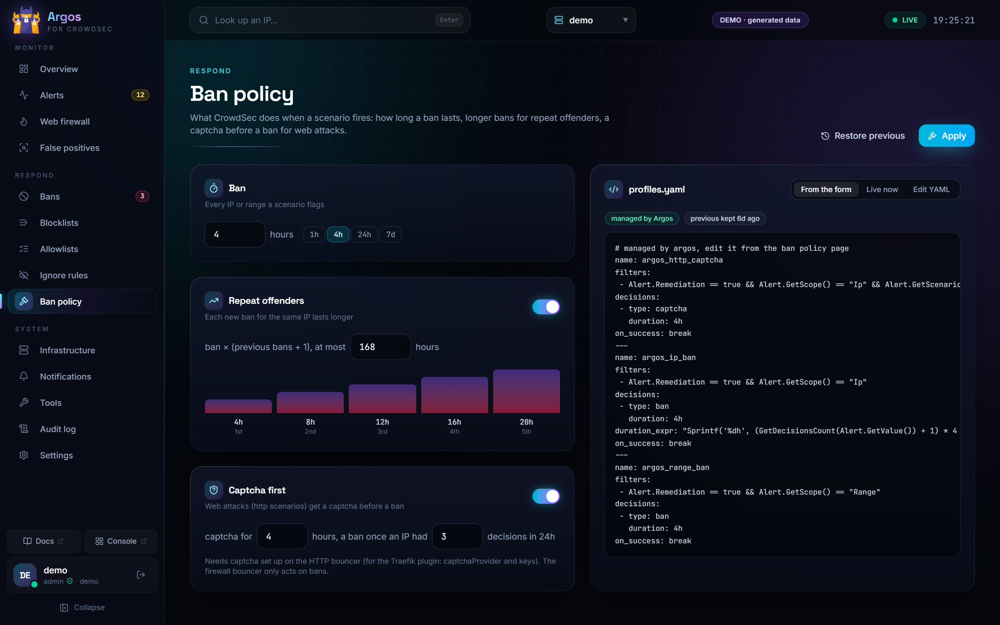
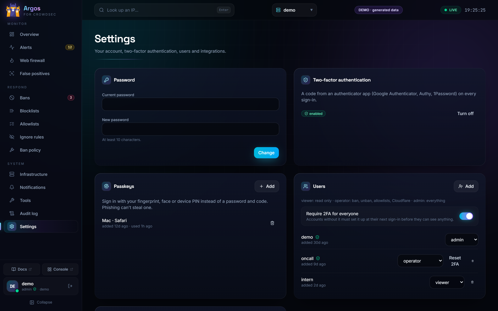
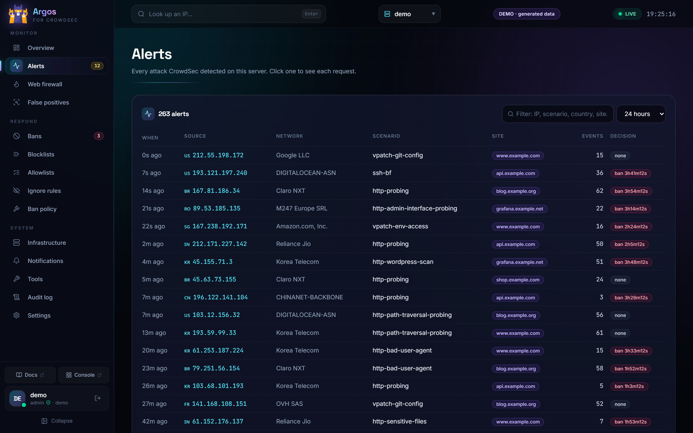
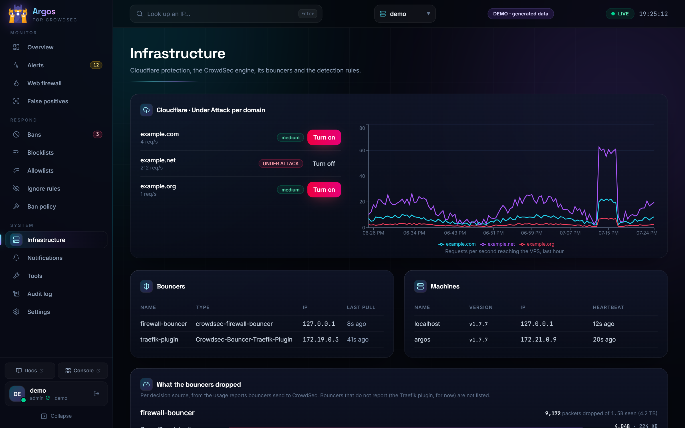
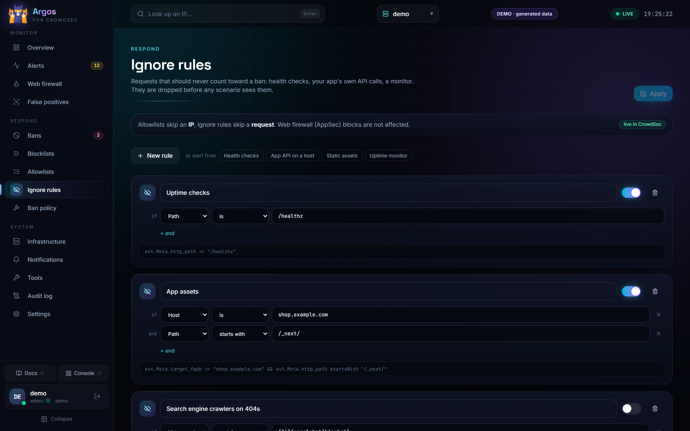
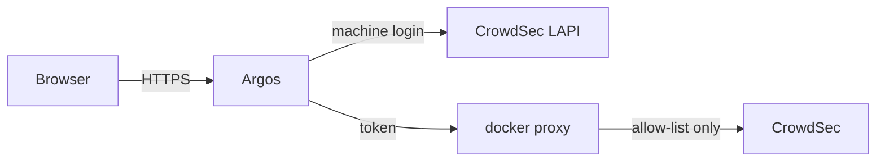

<p align="center">
  
</p>

<p align="center">
  <a href="https://github.com/georgemos940/crowdsec-argos-ui/releases/latest"></a>
  <a href="https://github.com/georgemos940/crowdsec-argos-ui/actions/workflows/docker.yml"></a>
  <a href="https://github.com/georgemos940/crowdsec-argos-ui/pkgs/container/crowdsec-argos-ui"></a>
  
  
</p>

<p align="center">
  <a href="#try-it-in-10-seconds">Try it</a> ·
  <a href="#install">Install</a> ·
  <a href="#features">Features</a> ·
  <a href="#configuration">Configuration</a> ·
  <a href="#guides">Guides</a> ·
  <a href="#security">Security</a> ·
  <a href="CHANGELOG.md">Changelog</a>
</p>

<p align="center"><i>Argos Panoptes, the hundred-eyed watchman who never slept.</i></p>

Argos is a self-hosted web panel for [CrowdSec](https://www.crowdsec.net/). It shows every attack as it happens, and lets you ban, unban, run blocklists and the hub, decide how CrowdSec bans, and catch the bans that hit your own users. It does all of it from one fast UI you can safely hand to a team. One Docker image, no database server, works with the CrowdSec you already run.

## Try it in 10 seconds

No CrowdSec needed. The demo runs on generated data, with attacks arriving live on the map. Nothing can be changed.

```sh
docker run --rm -p 3000:3000 -e DEMO=1 ghcr.io/georgemos940/crowdsec-argos-ui:latest
```

Then open `http://localhost:3000`.

## Features

<table>
<tr>
<td width="50%" valign="top">

### Watch

- **Live overview**: attacks, attacking IPs and bans, a world map with an arc from every attacker to your server, and a live feed
- **Alerts** with the requests behind them: path, status, user agent, site
- **IP profiles**: history, sites and paths hit, reputation from CrowdSec CTI or AbuseIPDB, falling back when one runs out of quota
- **Web firewall**: CrowdSec AppSec metrics, blocked requests and the rules that fired

</td>
<td width="50%"></td>
</tr>
<tr>
<td width="50%"></td>
<td width="50%" valign="top">

### Catch the mistakes

- **False positives**: bans that look like a real visitor or your own app (home network, mostly 2xx answers, Next.js prefetches, the same app path from several users, unbanned before). Each one says why, with allow, unban or ignore rule in one click
- **Ignore rules**: requests that never count toward a ban (health checks, your app's API, a monitor), by path, host, user agent, method or status
- **Simulation mode** per scenario, to try a rule without banning anyone

</td>
</tr>
<tr>
<td width="50%" valign="top">

### Respond

- **Bans** for IPs, ranges, countries and AS numbers, in bulk, or a captcha instead
- **Blocklists**: Spamhaus DROP, FireHOL level 1, Tor exits, AbuseIPDB or any URL, on a schedule. Private ranges, your own IPs and Cloudflare are always skipped
- **Allowlists** for the IPs CrowdSec must never ban
- **Ban policy**: ban length, longer bans for repeat offenders, a captcha before the ban for web attacks, or `profiles.yaml` by hand. CrowdSec checks the file before it restarts into it, and the old one goes back if anything is off

</td>
<td width="50%"></td>
</tr>
<tr>
<td width="50%"></td>
<td width="50%" valign="top">

### Run CrowdSec

- **Hub store**: collections, scenarios, parsers and AppSec rules, upgrades with a dry-run preview, and CrowdSec restarts on its own
- **Several CrowdSec servers** in one Argos, switched at the top
- **Bouncer usage**: what each bouncer dropped, per decision source
- **Tools**: the `cscli explain` log tester and CrowdSec Console enrollment
- **Cloudflare** Under Attack mode per zone, with a req/s chart

</td>
</tr>
<tr>
<td width="50%" valign="top">

### Get told

- **Discord** embeds you design in the UI with a live preview, with a per-IP cooldown and an hourly cap
- **Telegram, Slack, ntfy, email** and signed JSON webhooks
- A **daily or weekly summary** of attacks, bans, top countries and sites
- **Grafana alerts** turned into proper Discord embeds

</td>
<td width="50%"></td>
</tr>
<tr>
<td width="50%"></td>
<td width="50%" valign="top">

### Let your team in

- **Roles**: viewer, operator, admin
- **Passkeys**, TOTP 2FA, and *Require 2FA for everyone*
- **Single sign-on** with any OpenID Connect provider, roles from its groups
- **API tokens** for scripts
- An **audit log** of every change, and an installable app (PWA)

</td>
</tr>
</table>

<details>
<summary><b>More screenshots</b></summary>
<br>

| | |
|---|---|
|  |  |
|  |  |
|  |  |
|  | |

</details>

## Install

### New to CrowdSec: all in one

[`examples/all-in-one`](examples/all-in-one) runs CrowdSec, Traefik with the CrowdSec bouncer, a test app and Argos together. Argos registers itself with CrowdSec on first start.

```sh
cd examples/all-in-one
cp .env.example .env        # four secrets: openssl rand -hex 32
docker compose up -d
docker compose logs argos | grep 'Setup token'
```

The app is on `http://localhost:8080`, Argos on `http://localhost:3000`. Add the `crowdsec@docker` middleware to any other router you want protected.

### Existing CrowdSec

CrowdSec must already run in Docker. Argos talks to its Local API as a machine, and runs `cscli` in the CrowdSec container through a small proxy.

**1. A machine for Argos** (or set `LAPI_AUTO_REGISTER=true` and skip this)

```sh
PW=$(openssl rand -hex 32)
# -f /dev/null keeps cscli from overwriting crowdsec's own credentials file
docker exec crowdsec cscli machines add argos --password "$PW" -f /dev/null
echo "$PW"
```

**2. Configure**

```sh
cp .env.example .env
# LAPI_PASSWORD: the password above. SESSION_SECRET and DOCKER_PROXY_TOKEN: openssl rand -hex 32
```

**3. Run**

```sh
docker compose up -d
docker logs argos | grep 'Setup token'
```

Open `http://127.0.0.1:3010`, paste the setup token and create the first admin.

> [!TIP]
> Images are tagged with the version (`1.1.0`, `1.1`) and `latest` follows `main`. Pin a version if you'd rather upgrade by hand.

## Configuration

Everything else (CTI and AbuseIPDB keys, Discord, channels, blocklists, SSO, more servers) is set in the UI.

<details>
<summary><b>Environment variables</b></summary>
<br>

| Variable | Default | |
|---|---|---|
| `SESSION_SECRET` | | required, signs sessions |
| `LAPI_URL` | `http://crowdsec:8080` | CrowdSec Local API |
| `LAPI_USER` / `LAPI_PASSWORD` | | the machine from step 1 |
| `LAPI_AUTO_REGISTER` | `false` | `true` creates that machine through `cscli` when the login is refused (password 16+ chars) |
| `DEMO` | | `1` runs on generated data, read-only, no CrowdSec needed |
| `CROWDSEC_CONTAINER` | `crowdsec` | container name for `cscli` and restarts |
| `DOCKER_PROXY_URL` / `DOCKER_PROXY_TOKEN` | | how Argos reaches Docker through `argos-docker-proxy` (set in `docker-compose.yml`) |
| `DOCKER_SOCKET` | `/var/run/docker.sock` | only without the proxy |
| `DATA_DIR` | `./data` | SQLite database (users, settings, audit) |
| `INSTANCE_NAME` | `crowdsec` | shown in the sidebar, used for Console enrollment |
| `PUBLIC_URL` | | `https://argos.example.com`, the address people open. Passkeys and SSO are bound to it; without it Argos takes it from the request |
| `HOME_LAT` / `HOME_LON` | Frankfurt | your server on the attack map |
| `SELF_IPS` | | IPs or ranges blocklists must never ban |
| `PROM_URL` | `http://prometheus:9090` | optional, charts |
| `CF_API_TOKEN` / `CF_ZONE_IDS` | | optional, Cloudflare Under Attack switch. The token needs Zone Settings edit |
| `ZONE_RPS_QUERY` | | optional, Prometheus query with a `zone` label for the Cloudflare chart |
| `COOKIE_SECURE` | `true` | `false` only when serving over plain http |
| `TRUST_PROXY` | `false` | `true` behind a reverse proxy, so login limits and the audit log see the real client IP from `X-Real-IP` / `X-Forwarded-For`. Leave it `false` when Argos is reached directly, or anyone can fake their address |

</details>

## Guides

<details>
<summary><b>More than one CrowdSec</b></summary>
<br>

The server in the environment is the main one. Add others in **Settings → CrowdSec instances**:

1. on that server, a machine for Argos: `docker exec crowdsec cscli machines add argos --password "$PW" -f /dev/null`
2. optionally its own `argos-docker-proxy` (the same service as in `docker-compose.yml`, with a `PROXY_TOKEN`), for cscli, the hub, ban policy and ignore rules there. Without it you still get alerts, bans and allowlists through the LAPI
3. the LAPI URL, machine name and password, and the proxy URL and token in Argos. **Test connection** checks both

Reach other servers over a VPN (Tailscale, WireGuard) or HTTPS, not plain HTTP across the internet: the LAPI password and the proxy token travel with every request. Alerts from every instance reach your channels with its name on them, and blocklists go to all of them. The daily / weekly summary covers the main instance.

</details>

<details>
<summary><b>Single sign-on</b></summary>
<br>

**Settings → Single sign-on** takes the issuer URL, a client ID and secret from your provider, and shows the redirect URI to register there (`https://<argos>/api/auth/sso/callback`, so set `PUBLIC_URL`). Then either

- link existing accounts: each user signs in with their password once and presses **Link** in Settings, or
- let people in on first sign-in as viewer or operator, limited to your email domains, or
- set a groups claim with admin / operator / viewer groups, and the provider decides the role on every sign-in.

Authorization code with PKCE, the ID token signature is checked against the provider's keys, and the sign-in has to finish in the browser that started it. An SSO sign-in counts as two-factor, so enforce MFA at the provider.

</details>

<details>
<summary><b>API</b></summary>
<br>

Everything the UI does goes through `/api`, and scripts can use it too. Create a token in **Settings → API tokens** (viewer or operator, with an expiry), then:

```bash
# active bans
curl -H "Authorization: Bearer argos_..." https://argos.example.com/api/decisions

# ban an IP for 24h (operator token)
curl -X POST -H "Authorization: Bearer argos_..." -H "Content-Type: application/json" \
  -d '{"scope":"Ip","value":"203.0.113.7","duration":"24h","reason":"from my script"}' \
  https://argos.example.com/api/decisions

# live alerts as server-sent events
curl -N -H "Authorization: Bearer argos_..." https://argos.example.com/api/stream
```

Only a hash of the token is stored. Admin actions (users, settings, tokens, ban policy) stay in the browser behind 2FA.

</details>

<details>
<summary><b>Grafana alerts to Discord</b></summary>
<br>

Grafana's Discord integration only fills the embed title. Point a **webhook** contact point at Argos instead. **Notifications → Grafana alerts** shows the URL and the bearer token to copy, and takes the Discord webhook the embeds go to. Grafana reaches Argos over the Docker network (`http://argos:3000/hooks/grafana`).

</details>

## Security



- **Argos never holds the Docker socket.** `argos-docker-proxy` does, from the same image, and only lets through:
  - an exec in the CrowdSec container whose argv passes the `cscli` allow-list (`server/src/argv.ts`), checked again there, never a shell
  - reading back the execs it created, and a restart of the CrowdSec container
  - reading and writing two files in the CrowdSec config, `profiles.yaml` and `parsers/s02-enrich/zz-argos-whitelists.yaml` (64 KB, text only), and `crowdsec -t` on them

  Everything else gets a 403, and the proxy sits on an internal-only network behind a token. If Argos itself were compromised, the worst it could do is run the allowed `cscli` commands.
- Passwords hashed with scrypt; sessions in `__Host-`, HTTP-only, `SameSite=Strict` cookies that end on a password or 2FA change
- Passkeys, TOTP that cannot be replayed, and an optional **Require 2FA for everyone**
- Failed logins limited per IP and per username; unknown usernames take as long as wrong passwords
- Every write needs a same-origin header and a matching `Origin` on top of the cookie
- CSP without inline scripts, HSTS, `frame-ancestors 'none'`, no-store on the API
- Blocklist URLs cannot reach private, loopback or link-local addresses (no SSRF into the LAPI, Docker or cloud metadata)
- Errors only carry details for signed-in users, and every change goes to the audit log

> [!IMPORTANT]
> Keep Argos off the open internet when you can: bind it to localhost or a VPN address, or put SSO or an IP allow-list in front. If it has to be public, serve it over HTTPS with `TRUST_PROXY=true` and turn on **Require 2FA for everyone**. An admin in Argos can run the allowed `cscli` commands on your CrowdSec.

Found a vulnerability? See [SECURITY.md](SECURITY.md).

## Development

```sh
npm install
npm run dev:web       # vite on :5173, proxies /api to :3000
SESSION_SECRET=dev LAPI_USER=... LAPI_PASSWORD=... LAPI_URL=http://localhost:8080 COOKIE_SECURE=false npm run dev:server
```

```sh
npm test              # parsers, allow-lists, proxy, roles, tokens, passkeys, sso, instances
DEMO=1 npm start      # after npm run build
```

Node 22, Hono, node:sqlite, React 19, Vite, Tailwind 4, Recharts, d3-geo.

## License

[MIT](LICENSE). Argos is an independent project, not affiliated with CrowdSec.
